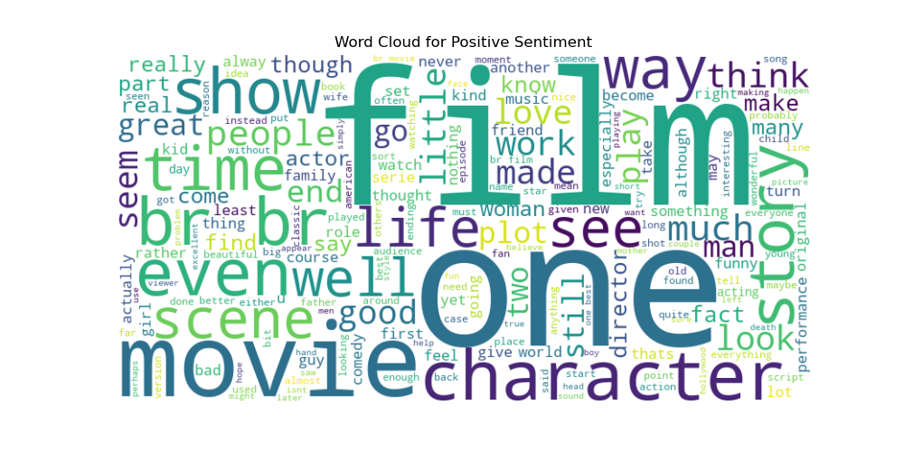

# 📊 Sentiment Analysis Web App

**Leveraging Social Media Analytics for Insightful Customer Sentiment and Preference Mapping**

This is a sentiment analysis web application built using Flask that allows users to analyze text data (single or bulk) and understand the underlying sentiment trends from social media or any textual source.

---

## 🚀 Project Overview

This application enables users to:

- 🧠 Predict sentiment of individual text entries
- 📁 Upload a CSV file for batch analysis
- 📊 Visualize sentiment distributions and insights
- 🌐 Use a web interface to make predictions in real time

The goal is to help organizations and individuals understand public opinion, customer sentiment, and preference patterns from text data.

---

## 📌 Features

- ✅ Single-text sentiment prediction via web form
- ✅ Batch CSV upload for large datasets
- 📈 Chart visualizations (e.g., sentiment distribution, word clouds)
- 📊 Metrics page showing evaluation results
- 🧪 Simple architecture with expandable model support

---

## 📁 File Structure

```
Sentiment-Analysis-App/
├─ app.py                      # Flask app (entrypoint)
├─ requirements.txt            # Python dependencies
├─ README.md                   # Project documentation (this file)
├─ train_sentiment_model.ipynb # Notebook for training & evaluation
├─ assets/                     # Result images and thumbnails (uploaded)
│  ├─ Home.png
│  ├─ Predict.png
│  ├─ Prediction result.png
│  ├─ Model Accuracy.png
│  ├─ ROC Curve.png
│  ├─ wordcloud_positive.png
│  └─ wordcloud_negative.png
├─ templates/                  # HTML templates

---

## 🖼️ Screenshots

**Home**


**Predict (form)**


**Prediction result**


**Model metrics (accuracy)**


**ROC curve**


**Word clouds**




---
├─ static/                     # CSS and static assets
├─ sentiment_model.pkl         # (included) trained sklearn model (sample)
├─ vectorizer.pkl              # (included) vectorizer (sample)
└─ results/                    # (excluded) training checkpoints & artifacts
```

---

## ⚡ Quickstart — run locally (Windows)

1. Clone the repo:

```bash
git clone https://github.com/<your-username>/sentiment-analysis-app.git
cd sentiment-analysis-app
```

2. Create and activate a virtual environment:

```bash
python -m venv venv
venv\Scripts\activate
```

3. Install dependencies:

```bash
pip install -r requirements.txt
```

4. Obtain pretrained model artifacts (one of the options below):
- Option A (recommended): This repository includes a **small sample** `sentiment_model.pkl` and `vectorizer.pkl` so you can run the app immediately. To use your own trained artifacts, replace these files in the project root with your versions.
- Option B: Train models using `train_sentiment_model.ipynb` and move artifacts to the root.
- Option C: Provide a HuggingFace BERT folder `bert_sentiment_model/` or an LSTM file `lstm_sentiment_model.h5` to use those branches.

> Tip: If you don't have model files and just want to see the UI, try uploading a small CSV or use the sample inputs in the Predict page.

5. Start the app locally:

```bash
python app.py
```

6. Or run in Docker:

```bash
make docker-build
make docker-run
```

7. Open the app in your browser:

```
http://127.0.0.1:5000/
```

---

## ✅ CI & Tests

This project includes a GitHub Actions workflow that runs tests on push and PRs to `main`. Run tests locally with:

```bash
pytest -q
```

---

## 🧾 License & Contribution

This repository is licensed under the MIT License. See the `LICENSE` file for details.

Contributions are welcome — please see `CONTRIBUTING.md` for guidelines.
---

## 🧾 Usage

- Home: Quick overview and prediction form
- Predict: Single-text input; returns sentiment label and confidence-based score
- Upload: CSV input — expects a `text` column; returns sentiment per row
- Metrics: Displays saved evaluation metrics (if `model_metrics.pkl` exists)
- Realtime: Simulated social feed demo for the given query

---

## ⚠️ Notes & Troubleshooting

- NLTK data: On first run `app.py` downloads `punkt`, `stopwords`, and `wordnet`. Allow network access.
- Missing model files: Follow Quickstart step 4. The repo intentionally excludes heavy artifacts to keep cloning fast.
- Git LFS: If you want to include very large images or models, use Git LFS to avoid bloating history.

---

## 🧩 Contribution & License

If you'd like, I can add an **MIT** license and a `CONTRIBUTING.md`. Reply **Yes** to add them and I will commit.

---

If you'd like the README further shortened, or want a quick demo script to run without model files, tell me and I will add it.