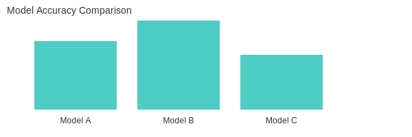
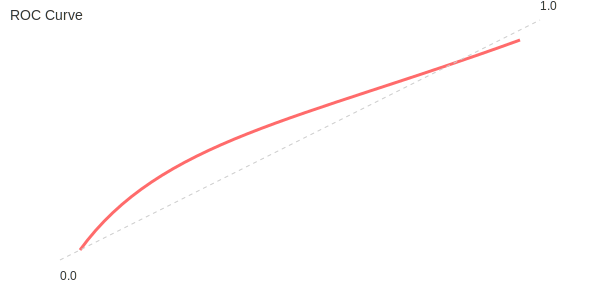

# Sentiment Analysis Web App 🔍🙂😞

A Flask web app for sentiment analysis built with a simple pipeline (preprocessing, vectorizer, traditional classifier) and optional BERT/LSTM support if you provide the trained artifacts. The app provides:

- Single-text sentiment prediction via a web form
- Batch CSV upload for analysis
- Model metrics page with interactive charts (Plotly)
- A simulated realtime demo page

---

## What I included in this repo ✅
- All code and templates required to run the app (`app.py`, `templates/`, `static/`)
- `requirements.txt` with required Python packages
- `.gitignore` that excludes large artifacts, raw dataset and training checkpoints (`results/`, `*.h5`, `*.pt`, etc.)

> Note: I **did not** include large model artifacts (e.g. `sentiment_model.pkl`, `vectorizer.pkl`), the full training dataset (`IMDB-Dataset.csv`) or the `results/` folder. This keeps the repository small and focused on reproducibility.

---

## Quickstart — run locally (Windows)
1. Clone the repo:

   git clone https://github.com/<your-username>/<repo-name>.git
   cd <repo-name>

2. Create and activate a virtual environment:

   python -m venv venv
   venv\Scripts\activate

3. Install dependencies:

   pip install -r requirements.txt

4. Obtain pretrained model artifacts (one of the options below):
   - Option A (recommended): Download `sentiment_model.pkl` and `vectorizer.pkl` and place them in the project root. These are used by the default "Traditional" classifier branch in `app.py`.
   - Option B: Train your models using the included notebook (`Untitled.ipynb`) and move the generated artifacts to the root.
   - Option C: Provide a HuggingFace BERT folder called `bert_sentiment_model/` or an LSTM model file `lstm_sentiment_model.h5` if you want to use those branches.

5. Start the app:

   python app.py

6. Open your browser at: http://127.0.0.1:5000/

---

## About the code
- `app.py` — Flask app and prediction logic. It selects between three model types depending on available artifacts:
  - `bert_sentiment_model/` directory → BERT (Transformers)
  - `lstm_sentiment_model.h5` → LSTM
  - `sentiment_model.pkl` + `vectorizer.pkl` → Traditional classifier (default)
- `templates/` — HTML pages for home, prediction, results, metrics, realtime demo
- `static/` — CSS and assets
- `Untitled.ipynb` — Notebook used for training, evaluation, and saving model artifacts (not included in commit history if heavy files are produced)

---

## Should I include result images to showcase performance? 🤔
Yes — I added a couple of small representative images to `assets/` to showcase results. I included SVG thumbnails (optimized and small) so they render well in the README without adding large files.

### Preview

I still recommend keeping only a few optimized images (<1MB each) rather than the full `results/` directory.

---

## Alternative project name suggestions
- SentimentScope
- MoodLens
- ReviewSense
- SentimentPulse
- OpinionAnalyzer

Pick one or tell me if you prefer a different style (short, playful, professional).

---

## Notes & troubleshooting
- NLTK corpora are downloaded at runtime in `app.py`. On first run you may see downloads for `punkt`, `stopwords`, and `wordnet`.
- If the app complains about missing model files, follow Step 4 above. If you want, I can add a short script to auto-download models from a remote storage location.

---

## License & contribution
If you'd like, I can add a `LICENSE` (MIT/Apache/BSD) file and a `CONTRIBUTING.md` with contribution guidelines.

---

If you want, I can now initialize the Git repo, commit only required files (code, templates, README, requirements), and create a **public** GitHub repo for you and push — do you want me to proceed with creating and pushing the remote repo now? Also tell me whether you'd like me to add a couple of small result images to `assets/` for showcase.